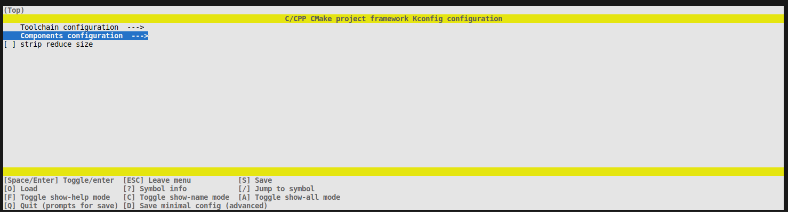
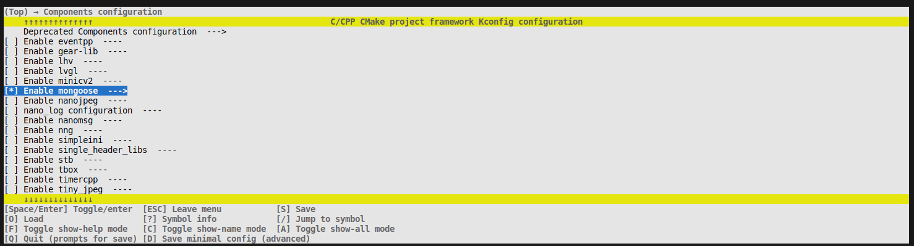
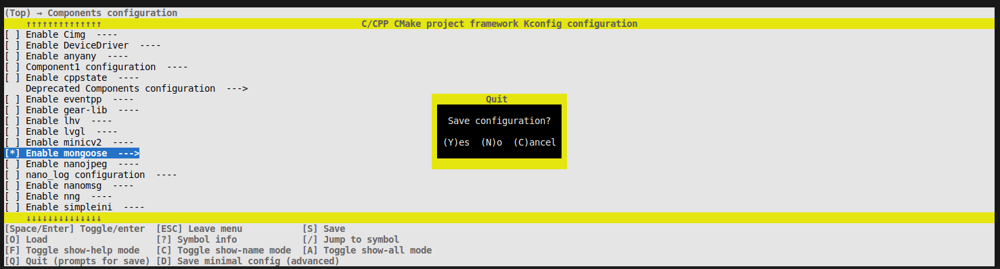
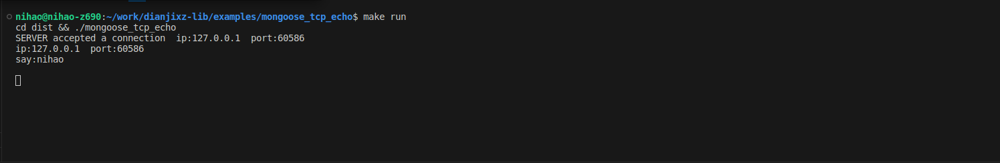
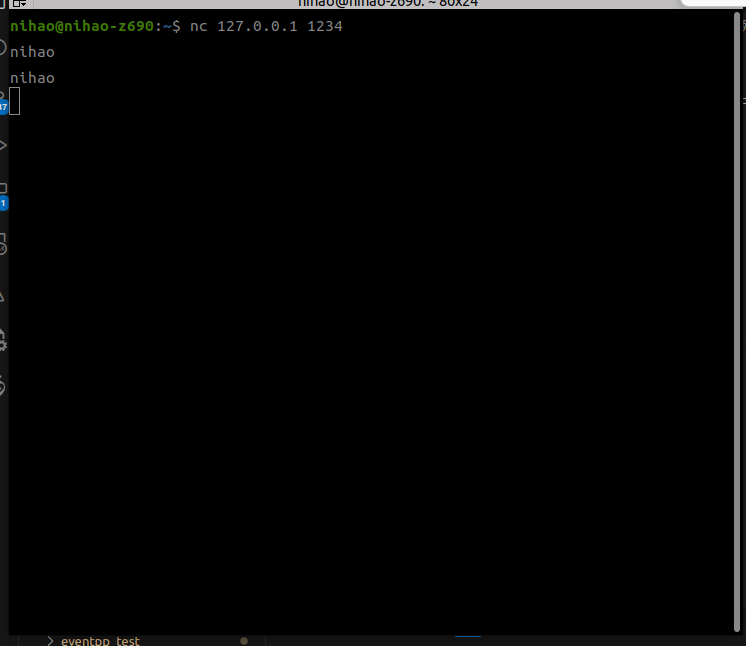

# 项目模板详细介绍

examples/demo1 文件夹是一个 hello world 项目，可以通过复制这个文件夹开快速创建自己的项目。

## 文件树
``` bash
demo1
├── build_after.sh
├── CMakeLists.txt
├── config_defaults.mk
├── main
│   ├── CMakeLists.txt
│   ├── include
│   │   └── main.h
│   ├── Kconfig
│   └── src
│       └── main.c
├── Makefile
└── project.py

4 directories, 10 files
```


- **main** 主代码文件夹
- **main/CMakeLists.txt** 主代码的 cmake 文件,需要手动添加依赖文件夹。
- **config_defaults.mk** 默认配置文件,存放默认组件配置。
- **build_after.sh** bash 脚本文件，在编译完成后自动执行的脚本。存在时候就执行，不存在就不执行。
- project.py 项目的启动入口，不用改动。
- CMakeLists.txt cmake的主文件，项目定义从这里开始，不需要改动。
- Makefile 便捷操作的 makefile 脚本,可以添加自己的命令,也可以重新定义原有的命令。


## 创建项目示例
以 examples/mongoose_tcp_echo tcp 回显服务器为例,通过复制 examples/demo1 文件来建立一个新项目。

mongoose 是一个轻量级 tcp 库,在 esp32 stm32 rp2040 和 linux 等设备中都可以轻松使用,便捷写出 tcp 项目。

```bash
# 进入 examples 文件夹
cd examples

# 复制 demo1 文件到 mongoose_tcp_echo
cp demo1 mongoose_tcp_echo -r

# 进入 mongoose_tcp_echo 文件
cd mongoose_tcp_echo

# 编辑 main/src/main.c 并输入下面内容


############################### mongoose_tcp_echo/main/src/main.c ###############################
#include "mongoose.h"

struct mg_mgr mgr;

void printf_connect(struct mg_connection *c)
{
  if (!c->rem.is_ip6)
  {
    printf("ip:");
    printf("%d", c->rem.ip[0]);
    printf(".");
    printf("%d", c->rem.ip[1]);
    printf(".");
    printf("%d", c->rem.ip[2]);
    printf(".");
    printf("%d", c->rem.ip[3]);
    printf("  port:%d \n", c->rem.port);
  }
}
static void cb(struct mg_connection *c, int ev, void *ev_data, void *fn_data)
{
  switch (ev)
  {
  case MG_EV_OPEN:
    break;
  case MG_EV_ACCEPT:
  {
    printf("SERVER accepted a connection  ");
    printf_connect(c);
  }
  break;
  case MG_EV_READ:
  {
    mg_send(c, c->recv.buf, c->recv.len); // Echo received data back
    printf_connect(c);
    printf("say:%s\n", c->recv.buf);
    mg_iobuf_del(&c->recv, 0, c->recv.len); // And discard it
  }
  break;
  case MG_EV_CLOSE:
    break;
  case MG_EV_ERROR:
    break;
  default:
    break;
  }
}
int main(int argc, char *argv[])
{
  mg_mgr_init(&mgr);                               // Init manager
  mg_listen(&mgr, "tcp://0.0.0.0:1234", cb, &mgr); // Setup listener
  for (;;)
  {
    mg_mgr_poll(&mgr, 1000); // Event loop
  }
  mg_mgr_free(&mgr); // Cleanup
  return 0;
}
#################################################################################################

```

在 mongoose_tcp_echo 目录下执行
```bash
make menuconfig
```
选中 Components configuration 进入



然后选中 Enable mongoose



按 q 退出



按 y 保存

然后执行编译
``` bash
make
```

编译无误后在 examples/mongoose_tcp_echo/dist 文件夹中生成 mongoose_tcp_echo 可执行文件

执行程序 mongoose_tcp_echo
```bash
./dist/mongoose_tcp_echo
```
使用 nc 测试程序的运行.

```bash
# 连接 tcp 服务器
nc 127.0.0.1 1234

# 随便输入信息,查看返回的信息.
```







## makefile 文件中的参数解释
```makefile
CROSS_DIR := /usr/bin           # 交叉编译器目录,设置交叉编译时使用
CROSS := arm-linux-gnueabihf-   # 交叉编译器前缀,设置交叉编译时使用
PUSH_FILE:=dist                 # 编译的文件输出目录
PUSH_DIR:=/root                 # 推送到嵌入式设备中的目录
PUSH_URL:=192.168.12.1          # 嵌入式设备的 ip 地址
MSSHF:=-o StrictHostKeychecking=no  # ssh 的前缀设备
SSH_USER:=m5stack               # 嵌入式设备用户名
SSH_PASSWORLD:=123456           # 嵌入式设备的密码

# 使用的推送命令模板,请参考使用
# scp ${MSSHF} -r ${PUSH_FILE} ${SSH_USER}@${PUSH_URL}:${PUSH_DIR}
```

## 交叉编译
``` bash
# 完全清理
make distclean

# 按照 makefile 预设设置交叉编译器
make set_arm

# 开启组件
make menuconfig

# 编译
make

# 按照 makefile 预算设置推送文件
make push

# 进入开发环境执行即可

```
## 交叉优化编译
```bash
# 完全清理
make distclean

# 按照 makefile 预设设置交叉编译器
make set_arm

# 开启组件
make menuconfig

# 编译
make release

# 按照 makefile 预设设置推送文件
make push

# 进入开发环境执行即可

```
## 更多命令
```bash
# 按照 makefile 预设进入嵌入式设备 shell
make shell

# 在本机直接运行
make run

# 按照 makefile 预设推送并执行
make push_run

```


